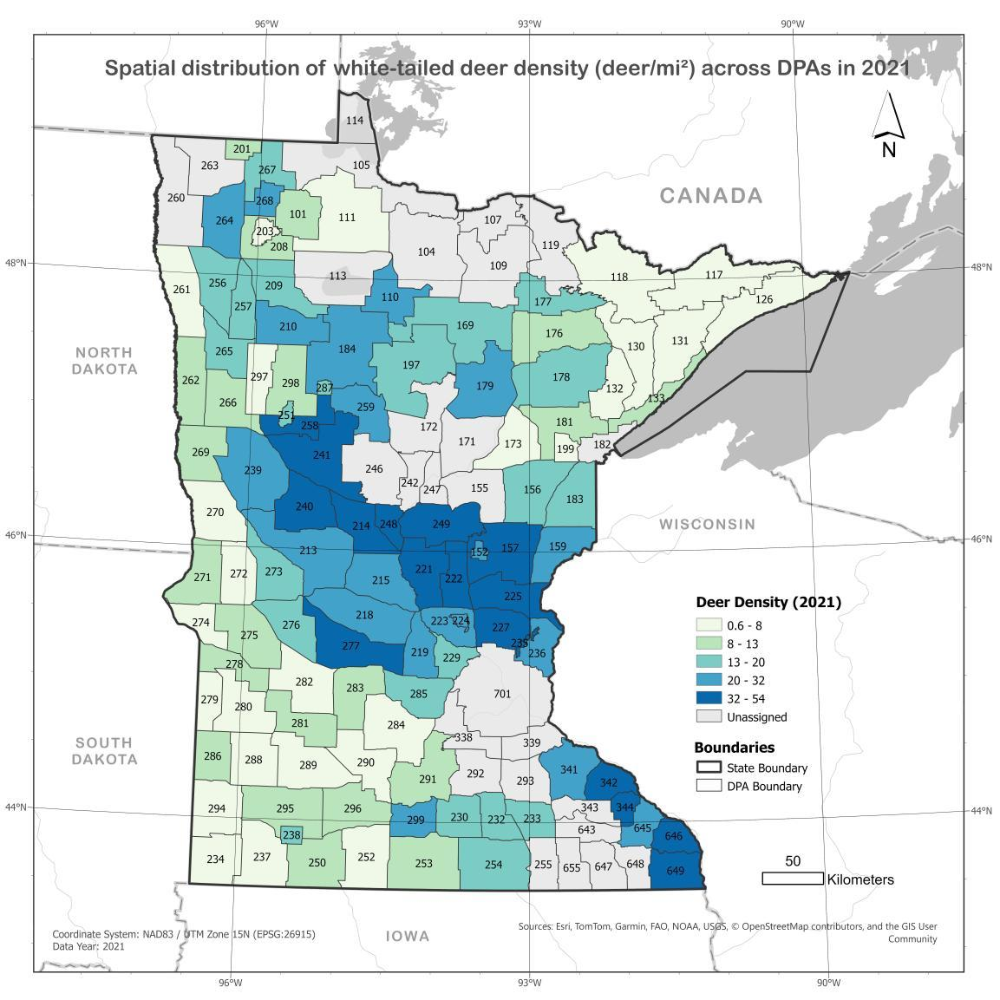
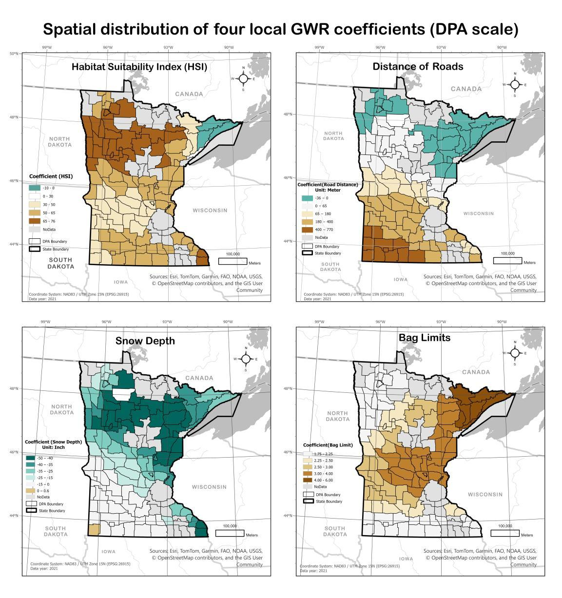
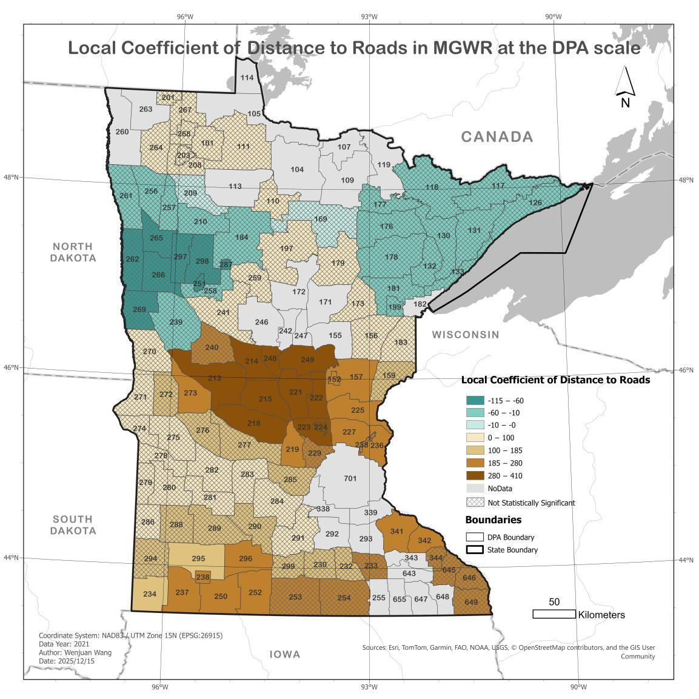

# Spatial-Determinants-of-White-Tailed-Deer-Density-in-Minnesota

A multi-scale spatial modelling project using OLS, GWR and MGWR to evaluate the drivers of white-tailed deer density in Minnesota (2021), comparing global and local regression models across Deer Permit Area (DPA) and Deer Modelling Unit (DMU) scales.
*Completed as my final project for GEOG693 (Master of Geospatial Data Science) at the University of Canterbury (February 2026).*

## Final Output

  

  <em>Figure 1. Spatial distribution of pre-fawn white-tailed deer density across Deer Permit Areas (2021; deer/mi²).</em>

## Key Results

<h2 align="center">
106 DPAs &nbsp; | &nbsp; 23 DMUs &nbsp; | &nbsp; R² 0.63 → 0.81
</h2>

<h3 align="center">
OLS 0.63 &nbsp;•&nbsp; GWR 0.72 &nbsp;•&nbsp; MGWR 0.81
</h3>

<em>AICc improved from 737 → 725 → 695; only MGWR removed all residual spatial autocorrelation at the DPA scale.</em>

## Key Skills Demonstrated
**Skills demonstrated:** spatial regression (OLS / GWR / MGWR) · spatial statistics (Global & Local Moran's I / LISA) · raster-based feature engineering (NLCD-derived HSI) · multi-scale analysis & MAUP evaluation · ArcGIS Pro (Spatial Statistics toolbox) · data integration across multiple open sources.

## Project Overview

White-tailed deer are ecologically and economically important across Minnesota, but overabundance can cause forest degradation, agricultural damage and wildlife-vehicle collisions. Understanding which factors drive deer density, and at what spatial scale they operate, is essential for effective deer management.

This study integrated four predictors — **habitat suitability (HSI), winter severity (snow depth), human accessibility (distance to roads), and hunting regulations (bag limits)** — to model pre-fawn deer density across Minnesota in 2021. A global model (OLS) was contrasted with spatially explicit models (GWR and MGWR) at two hierarchical management scales:

- **DPA scale (fine):** 106 Deer Permit Areas, the operational units for monitoring and harvest regulation;
- **DMU scale (intermediate):** 23 Deer Modelling Units used for regional policy decisions.

Comparing model behaviour across scales tests how spatial aggregation changes both statistical performance and ecological interpretation — a direct assessment of the **Modifiable Areal Unit Problem (MAUP)**.

## Data Sources

| Component | Source | Description |
|---|---|---|
| Deer density (2021, pre-fawn) | MNDNR Deer Population Model Report | Response variable (deer/mi²) |
| Land cover (NLCD 2021) | MRLC / USGS | Habitat structure → HSI |
| Winter snow depth (Jan–Mar 2021) | MNDNR Snow & Ice Atlas | Winter severity proxy (inches) |
| Road network | MnDOT | Human accessibility proxy (Euclidean distance, m) |
| Hunting regulations (bag limits) | MNDNR 2021 regulations | Ordinal 1–6, regulatory pressure proxy |
| DPA / DMU boundaries | Minnesota Geospatial Commons | Management units (DPA 132; modelled 106; DMU 23) |

### Coordinate Reference System

- All datasets reprojected to **NAD83 / UTM Zone 15N — EPSG:26915**.

## Methods

### 1. Habitat Suitability Index (HSI)

NLCD 2021 (30 m) land cover was resampled to 90 m and reclassified into Food (FD) and Cover (CV) suitability scores (0–1). Distance-decay functions (450 m forage, 210 m cover) produced food- and cover-relevance layers (FDLR, CVLR), and vegetation diversity (VD) was computed over a 270 m moving window. The final index used a geometric limiting-factor formulation:

**HSI = √(min(FDLR, CVLR) × VD)**

### 2. Winter Severity (Snow Depth)

Twelve weekly MNDNR snow maps (January–March 2021) were georeferenced and classified using ISO Cluster unsupervised classification; the seasonal **maximum** snow depth was derived by raster algebra, representing the peak overwinter survival constraint.

### 3. Road Accessibility

A Euclidean distance surface to motorised roads was generated from the MnDOT network at 90 m resolution.

### 4. Spatial Regression Modelling

All predictors were normalised to 0–1; deer density retained original units (deer/mi²). Multicollinearity was screened using VIF (all < 5).

- **OLS** — global baseline; residual spatial autocorrelation tested with Global Moran's I and Anselin Local Moran's I (LISA), using a row-standardised inverse-distance weights matrix.
- **GWR** — local coefficients with a single AICc-optimised bandwidth (fixed-distance kernel).
- **MGWR** — variable-specific bandwidths (adaptive kernels, AICc optimisation), allowing each predictor to operate at its own spatial scale. MGWR was not calibrated at the DMU scale due to severe local multicollinearity after aggregation.

## Results

### 1. Model Comparison at the DPA Scale (n = 106)

| Model | R² | Adj-R² | AICc | Residual spatial autocorrelation |
|---|---|---|---|---|
| OLS | 0.63 | 0.62 | 737 | Significant, all distance bands |
| GWR | 0.72 | 0.68 | 725 | Reduced (short-range only) |
| **MGWR** | **0.81** | **0.77** | **695** | **None** |

MGWR raised R² by 0.18 and cut AICc by 42 relative to OLS. Variable-specific bandwidths showed **distance to roads operating at a highly local scale (~30 neighbours)**, while HSI, snow depth and bag limits operated at near-statewide scales (~106 neighbours).

  

  <em>Figure 2. Local GWR coefficients for the four predictors at the DPA scale.</em>

  

  <em>Figure 3. Local MGWR coefficients for distance to roads — the only predictor with pronounced spatial non-stationarity, reversing from positive in the agricultural south to negative in the forested northeast.</em>

### 2. Cross-Scale Comparison (DPA vs DMU)

| Scale | Model | R² | AICc | Key finding |
|---|---|---|---|---|
| DPA | OLS | 0.63 | 737 | Residual clustering → global model inadequate |
| DPA | GWR | 0.72 | 725 | Partial improvement |
| DPA | MGWR | 0.81 | 695 | Multiscale processes resolved |
| DMU | OLS | 0.78 | 161 | Adequate at coarse scale |
| DMU | GWR* | 0.83 | 158 | Marginal gain (*3-predictor model, roads dropped) |

After aggregation to the DMU scale, residual autocorrelation and local heterogeneity largely disappeared: OLS became statistically sufficient and more parsimonious than the spatial models, while road effects were no longer detectable — a direct demonstration of the **MAUP** effect.

### 3. Key Findings

- **Road accessibility** is the only local-scale, context-dependent driver — a barrier in the agricultural south (hunter access, disturbance) but an edge/corridor facilitator in the forested northeast.
- **HSI and snow depth** are broad-scale drivers; snow consistently suppresses density, strongest in the snow-dominated northeast.
- **Bag limits** act as a management feedback loop: uniformly positive, tracking high-density areas.
- **Scale determines method choice**: fine-scale DPA data requires multiscale spatial models; coarser aggregation supports simpler global models.

## Limitations

- Single-year (2021) cross-sectional data — no temporal dynamics.
- Road metric is distance-based only; traffic volume, road class and seasonal closures not included.
- Bag limits are a regulatory proxy, not actual harvest.
- Results are conditional on administrative zoning (MAUP).
- Terrain, disease and land-ownership variables not included.

## Technology

- **Desktop GIS:** ArcGIS Pro 3.6
- **Spatial Statistics:** OLS, GWR, MGWR, Global Moran's I, Local Moran's I (LISA) — Spatial Statistics toolbox
- **Data:** NLCD 2021, MNDNR (deer population model, snow atlas, regulations), MnDOT road network, Minnesota Geospatial Commons
- **Raster Processing:** resampling, reclassification, distance decay, ISO Cluster classification, raster algebra

**Full report:** the complete 84-page report with literature review, detailed appendices (HSI workflow, snow processing, model diagnostics) and references is available here: **[GEOG693_Final_Report.pdf](GEOG693_Final_Report.pdf)**

**Questions or feedback? Reach me at nicole140002@gmail.com**
